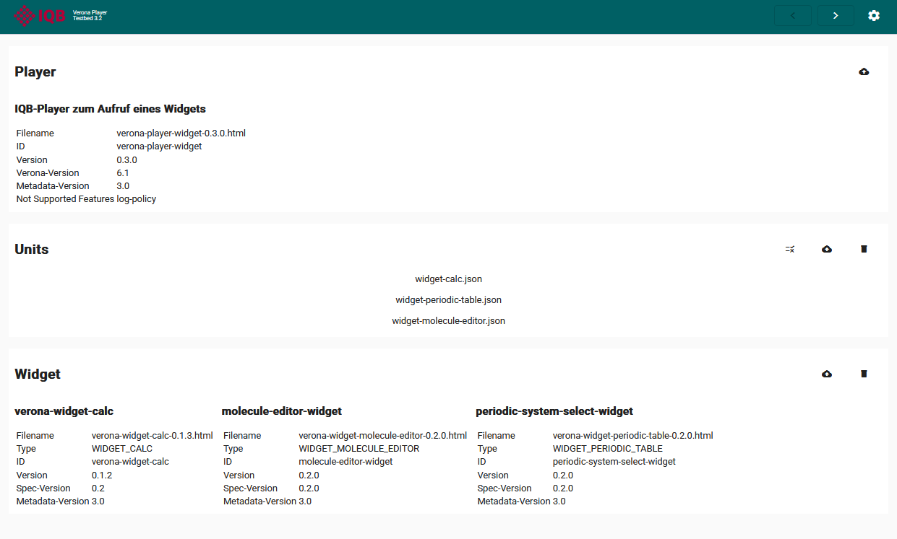

Ein Widget ist ein Interaktionselement, das vom Player angefordert wird. Es erweitert die Interaktionsmöglichkeiten auf universelle Art. Beispiel Taschenrechner: Ein Player kann der Testperson anbieten, einen Wert über einen virtuellen Taschenrechner zu ermitteln.

Die konkrete Einbindung des Widgets in eine Testumgebung ist nicht spezifiziert. Im IQB-Testcenter wird folgendes Verfahren umgesetzt: Das Widget unterbricht die Interaktion mit dem Player und dem übrigen Testsystem und legt sich als Overlay über die Applikationsseite (modaler Dialog). Erst nach Schließen/Beenden kehrt die Testperson zum Player zurück.

Es können Daten zwischen dem Player und dem Widget ausgetauscht werden. Die Spezifikation der API finden Sie [hier](https://verona-interfaces.github.io/widget/).

# Widget-Typ `model`

Es wird nie eine spezifische Widget-Implementation angefordert. Statt dessen wird ein Widget-Typ gerufen. Welches Widget dann konkret bereitgestellt wird, hängt von der Testumgebung ab. Hintergrund dieses Verfahrens ist die Möglichkeit, über den gesamten Test ein einheitliches Widget bereitzustellen. Der Widget-Typ ist in den Metadaten des Widgets im Eintrag `model` gespeichert.

Für die folgenden Widget-Typen stehen zur Verfügung:

* [Taschenrechner](calc.qmd) `CALC`
* [Periodensystem der Elemente](pse.qmd) `PERIODIC_TABLE`
* [Molekül-Editor](molecule.qmd) `MOLECULE_EDITOR`

# Kommunikation

```{mermaid}
sequenceDiagram
    autonumber
    participant HA as Host-Anwendung
    participant VM as Widget (Verona Modul)
    HA->>VM:Initialisierung
    VM->>HA:vowReadyNotification
    opt
        HA->>VM:vowStartCommand
    end
    opt
        VM->>HA:vowReturnRequest
    end
```

## 1 Initialisierung

Der Host richtet ein `<iframe>`-Element ein und setzt für das `srcdoc`-Attribut den kompletten Inhalt des Moduls. Das Modul ist technisch eine Html-Seite, d. h. es wird durch das Laden auch die Ausführung von JavaScript-Code angestoßen, der auf oberster Ebene vorgesehen ist.

## 2 Ready Notification

Dieser Code sendet als letzten Schritt der eigenen Initialisierung eine Nachricht an den Host, dass das Modul bereit sei für das Start-Kommando. Als Payload wird das [Metadaten-Objekt](../intro/metadata.qmd) mitgeschickt -- hier allerdings als String serialisiert, um nicht bei jeder Änderung der Metadaten-Spezifikation alle Modul-API ändern zu müssen.

## 3 Start Command

Das Startkommando ist nicht für alle Widgets zwingend erforderlich. Es könnte sich z. B. um eine statische Anzeige handeln, die keine weiteren Daten benötigt (z. B. interaktive Weltkarte).

Der Host kann jedoch über das Startkommando Daten schicken:

* `widgetConfig`: Einfache Liste von `key`/`value`-Paaren, die Varianten des Widgets steuern. Es könnte darüber beispielsweise ein bestimmter Funktionsumfang des Taschenrechners angefordert werden.
* `sharedParameters`: Einfache Liste von `key`/`value`-Paaren. Bedeutung siehe [hier](../intro/shared-parameters.qmd).
* `state`: Ein Zustand aus einem vorherige Aufruf des Widgets kann die UX verbessern.

## 4 State Changed Notification

Sobald eine Interaktion stattgefunden hat, kann das Widget diese Änderung melden. Parameter:

* `sessionId`: Die Kennung aus dem Start-Kommando, um die korrekte Zuordnung der Nachricht bzw. der darin enthaltenen Daten zur Unit zu unterstützen.
* `timeStamp`: Ein String im Standard-Format [date-time](https://tc39.es/ecma262/multipage/numbers-and-dates.html#sec-date-time-string-format). Die Nutzung dieser Information ist dem Host überlassen, soll aber vor allem die korrekte Reihenfolge vieler asynchron eintreffender Nachrichten sicherstellen.
* `sharedParameters`: Einfache Liste von `key`/`value`-Paaren. Bedeutung siehe [hier](../intro/shared-parameters.qmd).
* `state`: Der neue Bearbeitungsstatus als serialisiertes Datenobjekt (string).

Dass das Widget zwischenzeitlich einen neuen Status schickt, ist nicht erforderlich. Es könnte interessant sein, wenn man Bearbeitungsstände speichern möchte (Log).

## 5 Return Request

Diese Meldung wird an den Host geschickt, wenn die Testperson die Arbeit mit dem Widget beenden möchte. Über den Parameter `saveState` teilt das Widget mit, ob die Änderungen am Zustand/State wirksam (also an den Player geschickt) werden sollen, oder ob das Schließen ohne Speichern erfolgen soll (entspricht "Abbruch"). `state` und `sharedParameters` können mitgeschickt werden.

# Ausprobieren

Die Technologie der Widgets wird schrittweise in die Webanwendungen des IQB integriert. In jeder der Anwendungen (IQB-Testcenter, IQB-Studio) wird es spezielle Verfahren geben, wie die Widgests verfügbar gemacht werden. Um unabhängig von diesen Implementationen Widgets auszuprobieren, führen Sie die folgenden Schritte aus.

## Testbed herunterladen

Das IQB hat eine Referenzimplementierung der Verona-Schnittstellen für Player und Widgets veröffentlicht. Es handelt sich um eine Html-Datei, die man lokal ausführen kann. Dazu ist die jeweils aktuelle Version aus dem Release-Bereich des entsprechenden Repositories herunterzuladen.

Gehen Sie zum letzten [Release des Testbeds](https://github.com/iqb-berlin/verona-player-testbed/releases/latest). In den `assets` des Releases findet sich eine Datei `verona-player-testbed-<version>.html`. Durch Klicken auf den Dateinamen laden Sie die Datei herunter.

## Player herunterladen

Ein Widget wird von einem Player aufgerufen. Daher muss es einen Player geben, der diesen "call" erzeugt. Zur Demonstration hat das IQB einen Player programmiert, der alle vorhandenen Widgets aufruft. Über Parameter kann man den Aufruf modifizieren. Das Ergebnis des Widgets wird angezeigt.

Gehen Sie zum letzten [Release des Widget-Players](https://github.com/iqb-berlin/verona-player-widget/releases/releases/latest). In den `assets` des Releases findet sich eine Datei `verona-player-widget-<version>.html`. Durch Klicken auf den Dateinamen laden Sie die Datei herunter.

## Widgets und Beispiel-Units herunterladen

Die folgende Tabelle listet die Quellen für die Widgets (jeweils Html-Datei im `assets`-Bereich des Releases) und bietet einen Button für den Download einer passenden Unit-UI-Definition:

| Widget-Release | Unit |
| ------ | ---------------- |
| [Calc](https://github.com/iqb-berlin/verona-widget-calc/releases/latest) |  |
| [Molekül-Editor](https://github.com/iqb-berlin/verona-widgets-chemistry/releases/latest) |  |
| [Periodensystem der Elemente](https://github.com/iqb-berlin/verona-widgets-chemistry/releases/latest) |  |

## Testbed starten

Mit einem Klick auf die Html-Datei des Testbeds wird die Programmierung lokal im Browser gestartet. Danach laden Sie aus dem Download-Ordner den Player. Je nachdem, welches Widget Sie ausprobieren möchten, laden Sie das Widget und eine passende Unit-UI-Definition in das Testbed. Mit einem Doppelklick auf eine Unit oder mit dem Pfeil `>` starten Sie die Anzeige der Unit und können das Widget rufen.

{width="600" group="play"}